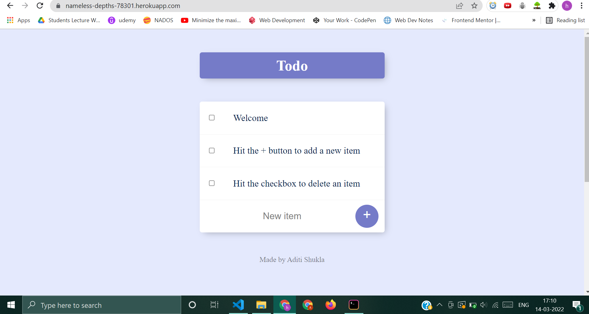
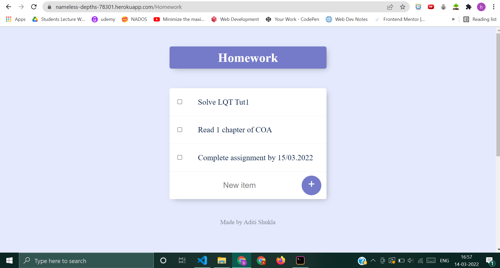
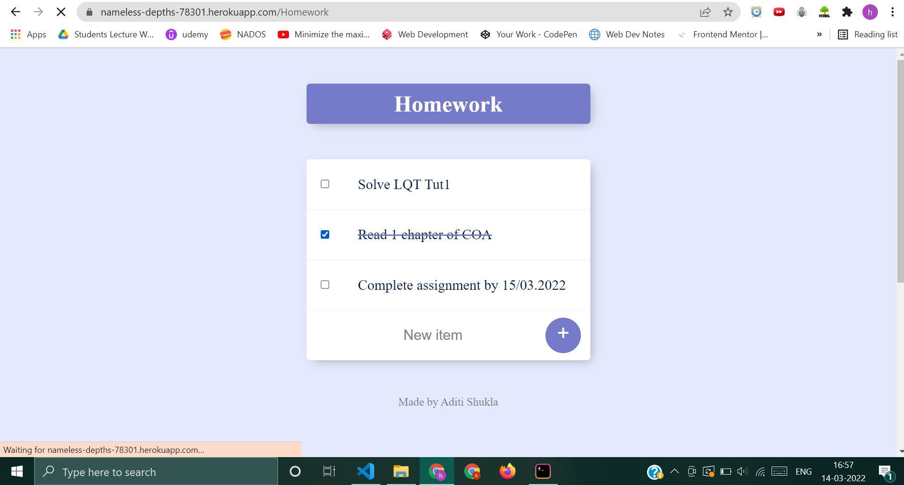

# 📝To-Do-List
Helps user to create a list of tasks you need to complete or things
that you want to do.

# Technologies used 
1. HTML5
2. CSS3
3. JAVASCRIPT
4. EJS
5. NODE.JS
6. EXPRESS
7. MONGODB  
8. HEROKU

# Screenshots

User can customize title of their todo list by adding the title at the end of website URL. 
example:

Tick the checkbox to delete an item.

# Project is hosted [here](https://nameless-depths-78301.herokuapp.com/)
